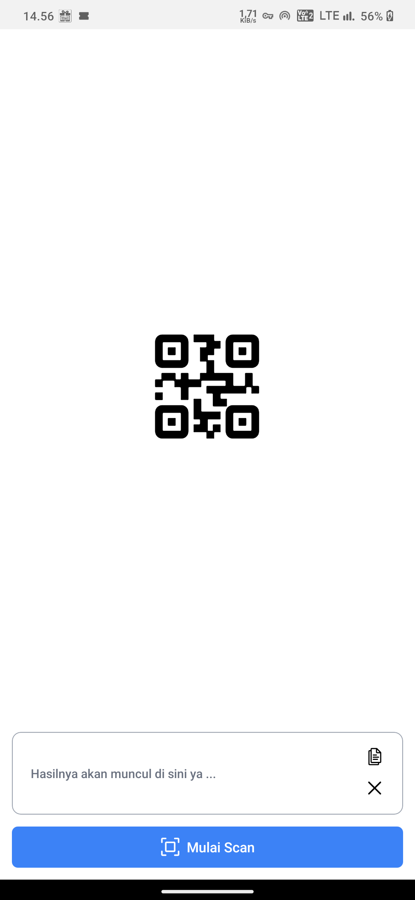
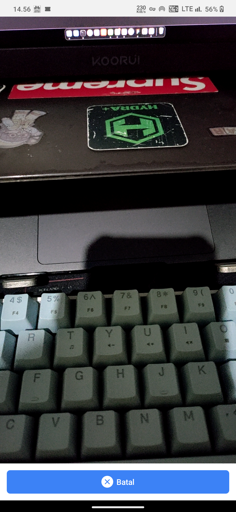
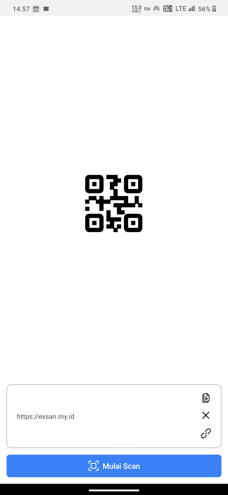

<h1>QRBARCODE SCANNER</h1>

This project build using react native expo and can use for scan qrcode or barcode, bellow is the layout app very simple, you can use this app in download. thank you !</h1>

 
First layout like welcome layout

 
 

 
Second layout to scan qrcode or barcode

 
 

 
Third layout is back to layout 1 but with value of scaning